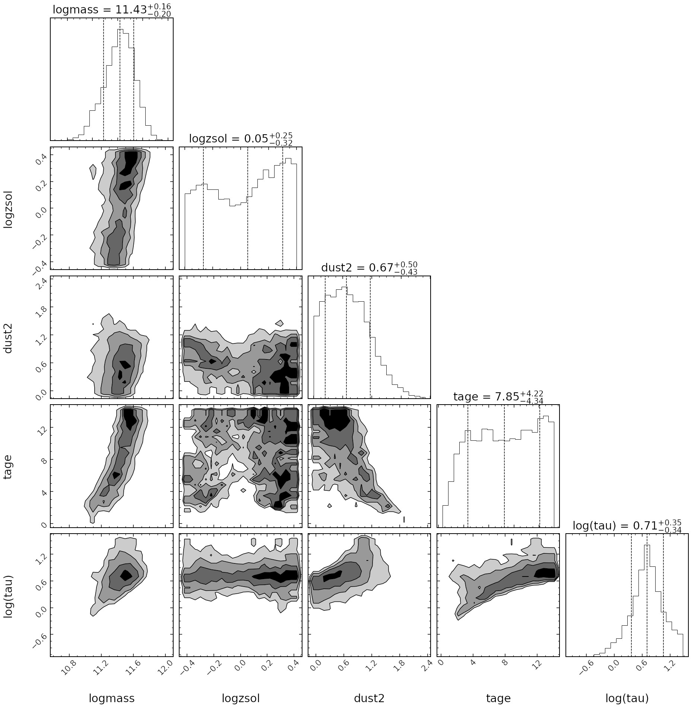
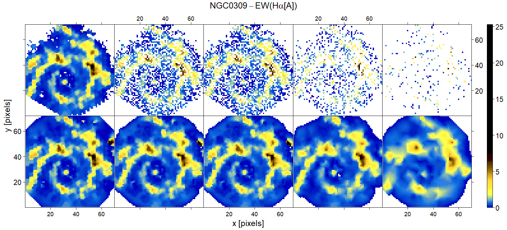
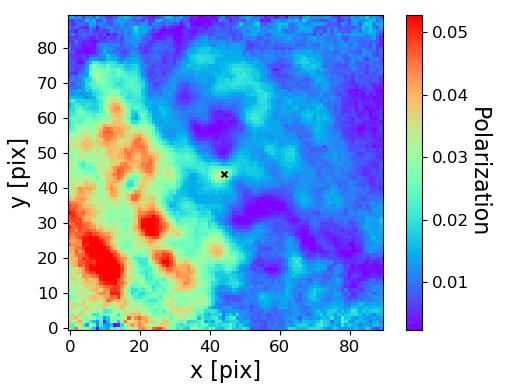
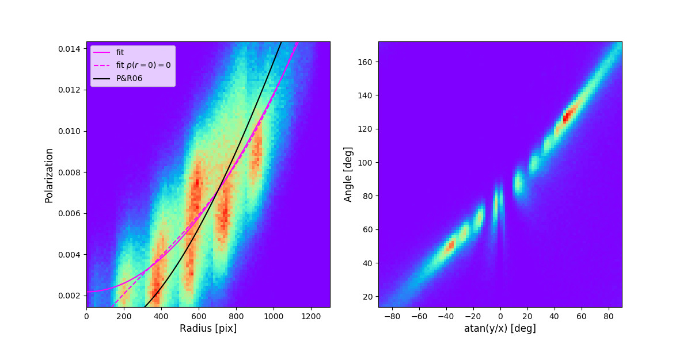
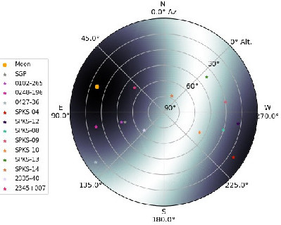
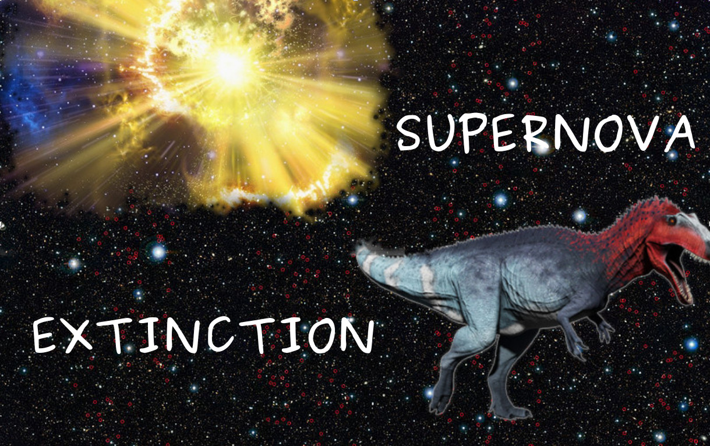

## Welcome to CRISP

CRISP is a multi-faceted project to study extinction towards supernovae and their environments though a variety of observational techniques including photometry,integral field spectroscopy and polarimetry of both SNe and their hosts, machine learning tools and theoretical 

### Team and collaborators

Alessandro Razza (U.Chile) 
Ana Mourão (CENTRA-IST) 
Ana Paulina-Afonso (CENTRA-IST) 
Antonia Morales-Garaffolo (U.Cádiz) 
Alberto Krone-Martins (Irvine) 
Beatriz Pereira (CENTRA-IST) 
Claudia Gutiérrez (U.Turku) 
Francisco Förster (U.Chile) 
João Duarte (CENTRA-IST) 
João Silvestre (CENTRA-IST) 
Joe Anderson (ESO) 
Lluis Galbany (U.Granada) 
Marko Stalevski (O.Belgrade) 
Majda Smole (O.Belgrade) 
Pedro Garcia (CENTRA-FCUL) 
Santiago González-Gaitán (CENTRA-IST) 
Thomas de Jaeger (U.Hawaii) 

### Projects

- **ARGAS: Artifically Redshifting of Galaxies (PI: A. Paulina-Afonso)**:  
Recent studies have shown that type Ia supernova (SN) distance estimation improves when using an additional term related to the host galaxy mass. However, the bias and systematics of using a limited set of broad-band filters across a large redhift range has never been evaluated. With extensive simulations of nearby integral field spectroscopy (IFS) galaxies set at high redshifts, we study here the impact of effects like dimming, scaling and SED fitting in current and future SN surveys.

- **Impact of varying colour-luminosity relation in type Ia supernova cosmology (PI: T. de Jaeger, S. González-Gaitán)**: 
Type Ia SN cosmology has been essential in determining the accelerated expansion of the universe. However, the standardization of their luminosity to measure distances relies on a color-luminosity calibration that generally assumes a constant factor throughout the SN Ia population. We investigate in this project the effect of letting this parameter vary. [Paper](https://ui.adsabs.harvard.edu/abs/2020arXiv200913230G/abstract) submitted.

- **Dust attenuation slopes of DES galaxies (PI: J. Duarte)**: 
We are obtaining for the first time a set of dust attenuation slopes for a cosmological sample of SNe Ia from their host galaxies with broad-band photometry from the Dark Energy Survey ([DES](https://www.darkenergysurvey.org/)) complemented with available GALEX UV photometry. We use the SED fitter [prospector](https://prospect.readthedocs.io/en/latest/) and [FSPS](https://dfm.io/python-fsps/current/) population synthesis code. The method is tested with simulations.

- **Dust attenuation slope maps of AMUSING galaxies (PI: A. Razza)**: 
We will obtaining map of dust attenuation slopes across nearby galaxies observed with Integral Fiel Spectroscopy (IFS) galaxies from the [AMUSING](https://amusing-muse.github.io/) survey. Spectra are complemented with optical, UV and NIR broad-band photometry. The method uses the SED fitter [prospector](https://prospect.readthedocs.io/en/latest/) and [FSPS](https://dfm.io/python-fsps/current/) population synthesis and is being tested with large simulations.

- **Galaxy spatial field reconstruction with INLA (PI: S. González-Gaitán)**:: 
The spatial correlations of astrophysical quantities are normally poorly taken into account. As part of the [COIN](https://cosmostatistics-initiative.org/) collaboration, we use here the Integrated Nested Laplace Approximation ([INLA](https://www.r-inla.org/)) machinery to obtain meaningful spatial reconstructions of IFS galaxy properties. The algorithm is very powerful when there is sparsity of data. [Paper](https://ui.adsabs.harvard.edu/abs/2019MNRAS.482.3880G/abstract) published.   

- **1.5D SED spatial fitting (PI: P. Garcia)**:
The next step of the INLA spatial fitting applied to galaxy IFS is to simulatenously fit the wavelength and the spatial dimension. In a first 1.5D approach, we iteratively fit SED at each spaxel with [prospector](https://prospect.readthedocs.io/en/latest/) while the spatial part is done with [INLA](https://www.r-inla.org/). 

- **Pilot project of polarimetric studies towards galaxies: the case of Circinus (PI: M. Stalevski, S. González-Gaitán)**: 
Imaging polarimetry of the nearby Circinus galaxy, host of an Active Galactic Nucleus (AGN), taken with FORS2-VLT in multiple optical bands allows the study of the geometry and dust characteristics of the central object and its galaxy. 

- **Polarimetric studies towards galaxies (PI: J. Silvestre)**: 
The first statistical study of multi-band imaging polarimetry with optical data from FORS2-VLT and CAFOS-CAHA will deliver nearby galaxy maps of various physical characteristics like dust and magnetic field alignment. The data will be compared with Monte Carlo radiative transfer simulations with the code [SKIRT](https://skirt.ugent.be/root/_landing.html).

- **Instrumental field polarization of FORS2-VLT (PI: S. González-Gaitán)**: 
Extended imaging polarization studies requires a full characterization of the instrument which is known to produce spurious polarization patterns. We study the instrumental field polarization of the FORS2 instrument at VLT finding a radial polarization across the CCD. [Paper](https://ui.adsabs.harvard.edu/abs/2020A%26A...634A..70G/abstract) published. 

- **Moon polarization patters in the Sky (PI: B. Pereira)**: 
The scattering from the Moon in the sky produces a polarization pattern that needs to be corrected for when performing polarimetric observations in the night. We are investigating the observed pattern taken with FORS2-VLT data compared with single scattering and multiple scattering models.

- **Supernova polarization evolution (PI: A. Morales-Garoffolo)**: 
We are investigating the evolution of the polarization of nearby SNe with linear imaging polarimetry with CAFOS-CAHA. Polarimetric studies reveal the asymmetries of SN explosions and provide a different view of the interstellar and circumstellar material around them.

- **Narrow absorption lines in supernovae (PI: C. Gutiérrez, S. González-Gaitán)**: 
The narrow absortpion lines found in SN spectra of all types reveal the slow moving material in the line of sight towards SNe. We are investigating the frequency, strength, evolution and velocity of several species like Na I D, Ca II H & K, K I and diffuse interstellar bands for an unprecedented large sample of supernova spectra. 

- **Evolution of dust reddening law towards SNe Ia**: 
We investigate if the dust reddening law, Rv, changes with phase of the evolution of type Ia supernovae. We use optical and near-infrared light-curve with the fitter [SNpy](https://csp.obs.carnegiescience.edu/data/snpy) to constrain reddening laws across time. This would shed light on progenitors by constraining possible circumstellar material and dust properties towards SNe Ia.

### Meetings
Some previous meetings:
- [CRISPinho 2020](https://amusing-muse.github.io/crispinho2020/)
- [CRISP 2020](https://amusing-muse.github.io/crisp2020/)
