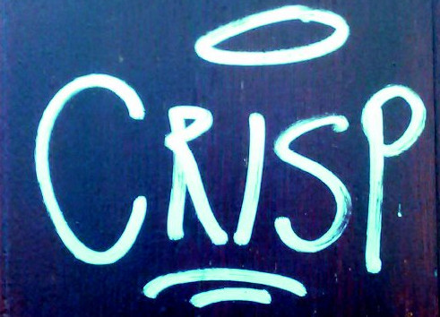
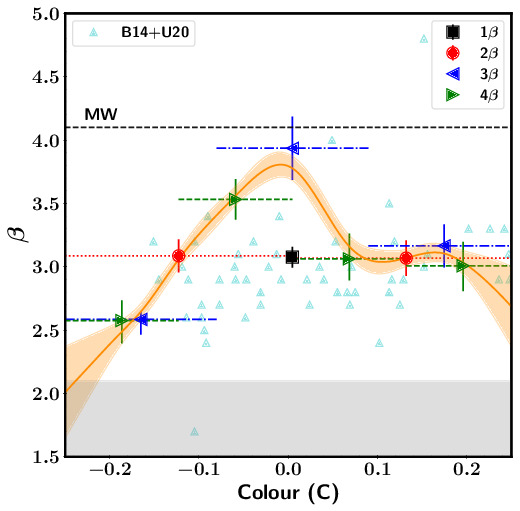
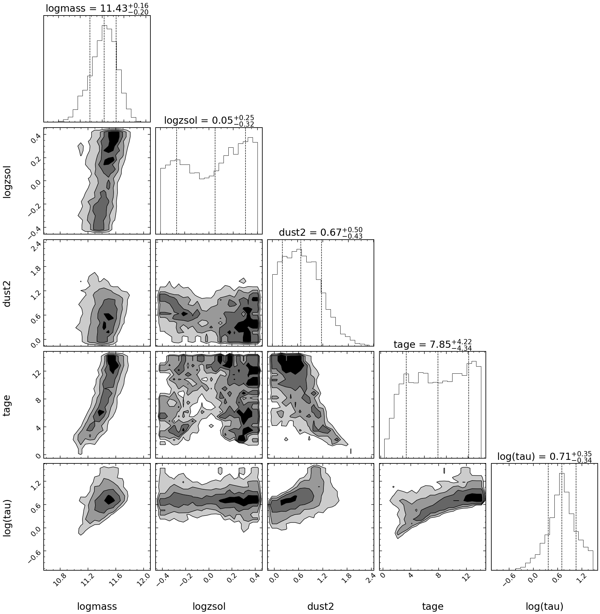

## Welcome to CRISP

CRISP is a multi-faceted project to study extinction towards supernovae and their environments though a variety of observational techniques including photometry,integral field spectroscopy and polarimetry of both SNe and their hosts, machine learning tools and theoretical 



### Team and collaborators

Alessandro Razza (U.Chile)<br/>
Ana Mourão (CENTRA-IST)<br/>
Ana Paulina-Afonso (CENTRA-IST)<br/>
Antonia Morales-Garaffolo (U.Cádiz)<br/>
Alberto Krone-Martins (Irvine)<br/>
Beatriz Pereira (CENTRA-IST)<br/>
Claudia Gutiérrez (U.Turku)<br/>
Francisco Förster (U.Chile)<br/>
João Duarte (CENTRA-IST)<br/>
João Silvestre (CENTRA-IST)<br/>
Joe Anderson (ESO)<br/>
Lluis Galbany (U.Granada)<br/>
Marko Stalevski (O.Belgrade)<br/>
Majda Smole (O.Belgrade)<br/>
Pedro Garcia (CENTRA-FCUL)<br/>
Santiago González-Gaitán (CENTRA-IST)<br/>
Thomas de Jaeger (U.Hawaii)<br/>

### Projects


- ARGAS: Artifically Redshifting of Galaxies (PI: A. Paulina-Afonso): <br/>
Recent studies have shown that type Ia supernova (SN) distance estimation improves when using an additional term related to the host galaxy mass. However, the bias and systematics of using a limited set of broad-band filters across a large redhift range has never been evaluated. With extensive simulations of nearby integral field spectroscopy (IFS) galaxies set at high redshifts, we study here the impact of effects like dimming, scaling and SED fitting in current and future SN surveys.


- [Impact of varying colour-luminosity relation in type Ia supernova cosmology](https://ui.adsabs.harvard.edu/abs/2020arXiv200913230G/abstract) (PI: S. González-Gaitán):<br/>
Type Ia SN cosmology has been essential in determining the accelerated expansion of the universe. However, the standardization of their luminosity to measure distances relies on a color-luminosity calibration that generally assumes a constant factor throughout the SN Ia population. We investigate in this project the effect of letting this parameter vary. 


- Dust attenuation slopes of DES galaxies (PI: J. Duarte):<br/>
We are obtaining for the first time a set of dust attenuation slopes for a cosmological sample of SNe Ia from their host galaxies with broad-band photometry from the Dark Energy Survey ([DES](https://www.darkenergysurvey.org/)) complemented with available GALEX UV photometry. We use the SED fitter [prospector](https://prospect.readthedocs.io/en/latest/) and [FSPS](https://dfm.io/python-fsps/current/) population synthesis code. The method is tested with simulations.


- Dust attenuation slopes of AMUSING galaxies (PI: A. Razza):<br/>
We will obtaining map of dust attenuation slopes across nearby galaxies observed with Integral Fiel Spectroscopy (IFS) galaxies from the [AMUSING](https://amusing-muse.github.io/) survey. Spectra are complemented with optical, UV and NIR broad-band photometry. The method uses the SED fitter [prospector](https://prospect.readthedocs.io/en/latest/) and [FSPS](https://dfm.io/python-fsps/current/) population synthesis and is being tested with large simulations.

- Polarimetric studies towards galaxies:<br/>

- 


```markdown
Syntax highlighted code block

# Header 1
## Header 2
### Header 3

- Bulleted
- List

1. Numbered
2. List

**Bold** and _Italic_ and `Code` text

[Link](url) and 
```

For more details see [GitHub Flavored Markdown](https://guides.github.com/features/mastering-markdown/).

### Jekyll Themes

Your Pages site will use the layout and styles from the Jekyll theme you have selected in your [repository settings](https://github.com/gongsale/CRISP/settings/pages). The name of this theme is saved in the Jekyll `_config.yml` configuration file.

### Support or Contact

Having trouble with Pages? Check out our [documentation](https://docs.github.com/categories/github-pages-basics/) or [contact support](https://support.github.com/contact) and we’ll help you sort it out.
